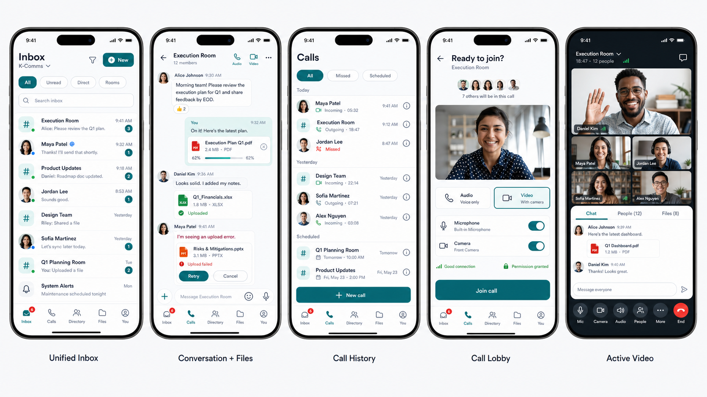

# K-Comms Mobile Mockup Audit and Improved Design

**Date:** 2026-07-24
**Scope:** Five-screen mobile communications concept covering direct messages, rooms, file sharing, call history, and active video.



## Executive verdict

The supplied mockup is a strong concept board but not yet a production-ready product design. It clearly communicates the feature set and has an appropriate enterprise tone, but it mixes destinations, media modes, and settings in one navigation layer. It also omits the call-setup lifecycle, relies on undersized and low-contrast metadata, and does not define enough failure, permission, or accessibility states.

**Indicative score: 5.5/10**

| Area | Score |
|---|---:|
| Visual polish | 7/10 |
| Information hierarchy | 7/10 |
| Navigation clarity | 5/10 |
| Component consistency | 5/10 |
| Accessibility | 4/10 |
| Real-world state coverage | 4/10 |
| Responsive readiness | 3/10 |

## What works

- The screens communicate a credible collaboration journey.
- Conversation and call lists are easy to scan.
- Teal gives the product a calm, recognizable enterprise identity.
- File collaboration is integrated with communication rather than treated as a separate utility.
- The active-call controls use familiar mobile conventions.

## Priority findings

| Priority | Problem | Why it matters | Improved design decision |
|---|---|---|---|
| P0 | `Calls` and `Video` are separate bottom-navigation destinations while Calls also contains Voice and Video tabs. | Users cannot predict where video history, new video calls, or active calls belong. | Keep one **Calls** destination. Voice and video are call modes selected from a conversation or call lobby. |
| P0 | The mockup jumps from `Start Call` directly to an active video session. | Recipient selection, media choice, permissions, ringing, joining, and connection failure are undefined. | Add `Select person/room → Audio or Video → Lobby/device preview → Join/Ring → Active call → Summary`. |
| P0 | Several icons, call actions, composer controls, and metadata appear below accessible mobile sizes. | Small targets increase errors; faint text and color-only states exclude low-vision and color-blind users. | Use 44×44 CSS-pixel minimum targets, 16px body text, 13–14px metadata, and text/icon redundancy for states. |
| P0 | Active-call safety states are missing. | Users need to know whether they are muted, recorded, reconnecting, leaving personally, or ending a group call. | Show explicit mic/camera state, connection quality, captions/recording state, and separate **Leave** from host-only **End for everyone**. |
| P1 | Individuals and rooms are separate inboxes with separate searches. | Unread work is hidden behind a switch and the model does not scale to mentions, pinned rooms, or alerts. | Use one **Inbox** with `All`, `Unread`, `Direct`, and `Rooms` filters. |
| P1 | Files appear as detached chat blocks, a global destination, and an in-call sheet without ownership rules. | Users cannot tell who can access a file or where it persists. | Every file belongs to a source conversation/message. The global Files view aggregates files and links back to their source. |
| P1 | Selected tabs use inconsistent visual treatments. | Users must relearn the same control on different screens. | Use one segmented-control component and one selected-state rule. |
| P1 | Essential states are absent. | Production use includes upload rejection, offline recovery, permission denial, no answer, declined calls, and poor networks. | Define loading, empty, offline, error, retry, permission, connecting, reconnecting, and ended states for every flow. |
| P1 | The concept uses `Kayilan Connect` while the current product is K-Comms. | Mixed naming weakens product identity and implementation consistency. | Use **K-Comms** consistently unless product governance explicitly selects another name. |
| P2 | The design assumes one phone size and default text scale. | Dense rows and controls will clip under localization, dynamic type, and narrow devices. | Support 320px, 360–479px, and 480–767px widths, 200% text, landscape calls, and safe-area insets. |

## Recommended information architecture

```text
K-Comms Workspace
├── Inbox
│   ├── All / Unread / Direct / Rooms
│   ├── Conversation
│   │   ├── Messages and inline attachments
│   │   ├── Audio call
│   │   ├── Video call
│   │   └── Info: People / Files / Links / Settings
│   └── New: Direct message / Create room / Join room
├── Calls
│   ├── All / Missed / Scheduled
│   ├── New call
│   └── Call detail / summary
├── Directory
│   ├── People
│   └── Rooms
├── Files
│   ├── Recent / Shared by me / Downloads
│   └── Source conversation
└── You
    ├── Profile and presence
    ├── Devices
    ├── Notifications
    └── Settings
```

The key model is: **a conversation is the persistent collaboration container; a call is a temporary session launched from it.**

## Improved five-screen design

### 1. Unified Inbox

- One workspace header with K-Comms identity, search, notifications, and an explicit **New** action.
- Filters: `All`, `Unread`, `Direct`, and `Rooms`.
- One chronological list of people and rooms.
- Consistent row anatomy: identity, preview/status, timestamp, unread or mention state.
- Presence, muted, failed-send, and mention states use text or icons as well as color.

### 2. Conversation + Files

- Header includes back, conversation identity, member count, separate audio and video actions, and information/overflow.
- Current-user messages are consistently right-aligned; other participants are left-aligned with sender identity.
- Attachments stay at the message that introduced them.
- Upload cards support progress, **Cancel**, failure reason, **Retry**, security scanning, and completion.
- The composer remains above the keyboard and exposes attach, text, camera, and send actions with accessible labels.

### 3. Call History

- Filters are `All`, `Missed`, and `Scheduled`; modality is shown in each row.
- Each entry states participant or room, audio/video, incoming/outgoing/missed, time, and duration.
- A single, thumb-reachable **New call** action starts person/room selection.
- Callback controls use at least a 44×44 target.

### 4. Call Lobby

- Displays the person or room and expected participants.
- Requires an explicit **Audio** or **Video** selection.
- Includes camera preview, microphone and camera toggles, device choice, permission status, and network readiness.
- Uses one clear **Join call** or **Start call** action.
- Permission denial and unavailable-device states provide a direct recovery route.

### 5. Active Video

- Header shows conversation, duration, participant count, connection quality, and privacy/recording status where applicable.
- Supports active-speaker and grid layouts.
- Primary controls are Mic, Camera, Audio, People, More, and End/Leave; each exposes its current state.
- The collaboration sheet uses `Chat`, `People`, and `Files`, has a named close action, and never covers the end-call control or critical alerts.
- Files shared during the call remain attached to the originating conversation afterward.

## Design-system direction

| Category | Tokens / rules |
|---|---|
| Brand | `brand-700 #005C61`, `brand-600 #006D73`, `brand-100 #DDF5F3`, `brand-50 #EFF9F8` |
| Text | `ink #0B1220`, `secondary #475569`, `muted #64748B`, `inverse #FFFFFF` |
| Surfaces | `canvas #F6F8FA`, `surface #FFFFFF`, `border #D8E0E7` |
| Semantic | `success #15803D`, `warning #B45309`, `danger #B42318`, `info #1D4ED8` |
| Live call | `call-bg #0B0F14`, `call-control #1E293B`, `call-scrim rgba(0,0,0,.55)` |
| Spacing | 4, 8, 12, 16, 20, 24, 32px |
| Radius | 8px controls, 12px cards, 16px sheets, full-pill badges |
| Layout | 16px page gutters, 56px top bars, 64px bottom navigation plus safe area |
| Touch | 44×44px minimum; 48px for primary actions |
| Motion | 150ms controls, 220ms sheets; respect reduced motion |

Typography uses Inter or the native system stack:

- Page title: 28/34, weight 700
- Detail title: 18/24, weight 650
- Row title: 15/20, weight 600
- Body/message: 14/20, weight 400–500
- Metadata: 12–14/16–20, weight 400–500
- Button: 14/20, weight 600

## Required reusable components

`AppShell`, `WorkspaceBar`, `PageHeader`, `SegmentedControl`, `SearchField`, `ConversationRow`, `AvatarPresence`, `UnreadBadge`, `MessageBubble`, `AttachmentCard`, `Composer`, `CallRow`, `CallLobby`, `CallControl`, `BottomNav`, `BottomSheet`, `ConnectionBanner`, and shared `Loading`, `Empty`, `Offline`, and `Error` states.

## Accessibility and production acceptance criteria

- WCAG AA contrast: 4.5:1 for normal text and 3:1 for large text and meaningful controls.
- VoiceOver and TalkBack can identify every action, selected tab, unread state, upload state, and call-control state.
- Navigation uses `aria-current`; tabs expose `aria-selected`; toggles expose `aria-pressed`.
- The conversation log announces new messages without interrupting users reading history.
- Uploads expose a named progress bar and explicit Cancel/Retry actions.
- Sheets trap focus, support keyboard/back dismissal, and restore focus to the trigger.
- The UI reflows at 320px and 390px without horizontal overflow.
- Text scales to 200% without clipping controls, names, timestamps, or call state.
- Portrait and landscape calls respect safe-area insets and keyboard/browser viewport changes.
- Reduced-motion users do not receive unnecessary animation.
- Tested states include offline recovery, upload failure, file-policy rejection, microphone/camera denial, no camera, ringing, declined/no-answer, reconnecting, participant join/leave, recording, and call termination.

This design is ready to become a responsive implementation specification after interaction states and final product naming are approved.
