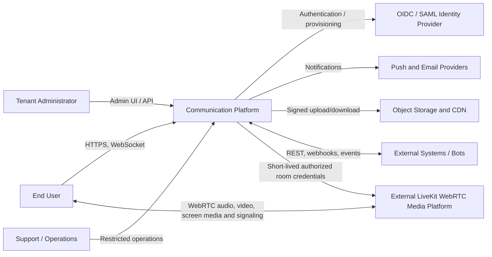

# C4 Level 1 — System Context

## Context notes

- The platform owns authorization and durable communication state.
- Identity providers authenticate or provision identities but do not authorize conversation access.
- Object storage owns binary durability; the platform owns attachment metadata and policy.
- The media infrastructure transports audio, camera video, screen media, and
  WebRTC signaling. Phoenix carries only content-free call lifecycle events,
  never SDP, ICE, RTP, SRTP, or provider credentials. ADR-0025 defines the
  unified media-source and privacy boundary.
