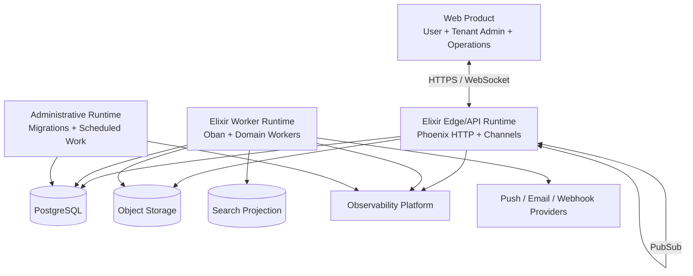

# C4 Level 2 — Container View

## Container responsibilities

| Container | Owns | Must not own |
|---|---|---|
| Edge/API | Authentication adapters, request validation, socket lifecycle, command dispatch | Durable state only in process memory |
| Worker | Retryable side effects and derived projections | User-facing synchronous acceptance path |
| Administrative | Controlled migrations and scheduled maintenance | Bypassing domain authorization for business changes |
| PostgreSQL | Authoritative transactional state | Large binary attachments |
| Object storage | Binary objects and variants | Membership or authorization truth |
| Search | Query-optimized derived content | Canonical message state |

The web product is one build with separate `/app`, `/admin`, and `/ops` route
and authorization boundaries. Operations APIs expose health and control state,
not routine tenant message content. Native desktop or mobile clients may reuse
the same public REST and realtime contracts later.
