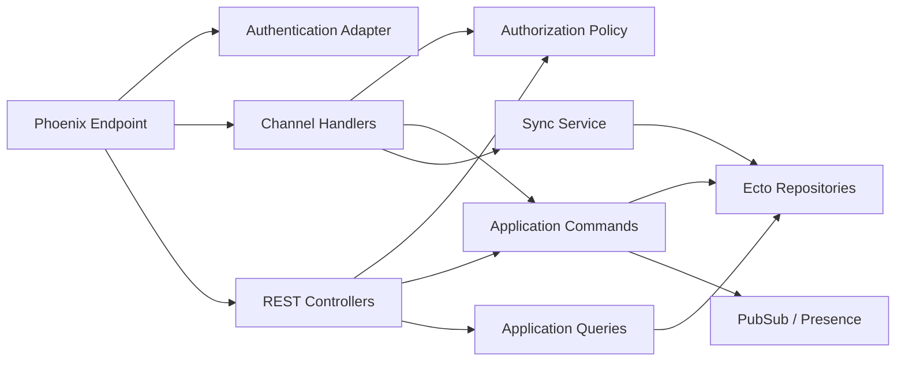

# C4 Level 3 — Edge/API Components

```mermaid
flowchart LR
    Endpoint[Phoenix Endpoint]
    Auth[Authentication Adapter]
    Policy[Authorization Policy]
    Channel[Channel Handlers]
    HTTP[REST Controllers]
    Commands[Application Commands]
    Queries[Application Queries]
    Sync[Sync Service]
    PubSub[PubSub / Presence]
    Repo[Ecto Repositories]

    Endpoint --> Auth
    Endpoint --> Channel
    Endpoint --> HTTP
    Channel --> Policy
    HTTP --> Policy
    Channel --> Commands
    HTTP --> Commands
    HTTP --> Queries
    Channel --> Sync
    Commands --> Repo
    Queries --> Repo
    Sync --> Repo
    Commands --> PubSub
```

Adapters translate external protocols into application commands. Domain modules do not depend on Phoenix controller, socket, or provider-specific structures.
