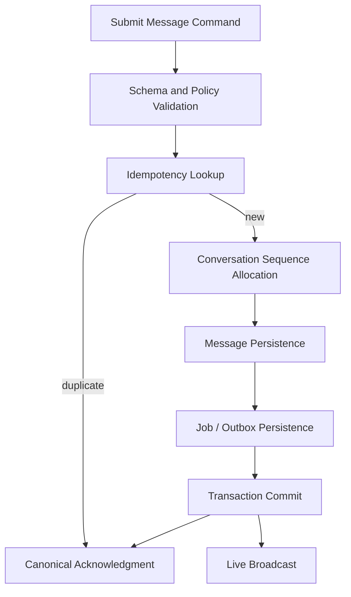

# C4 Level 3 — Messaging Components

The transaction boundary includes sequence allocation, message persistence, attachments/mentions, audit, and durable work requests. Live broadcast occurs after commit.
