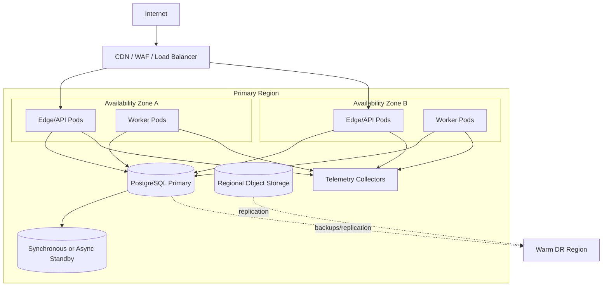

# Deployment View

The production design must tolerate loss of one application instance and one availability zone without losing acknowledged messages, subject to the approved database replication mode.
