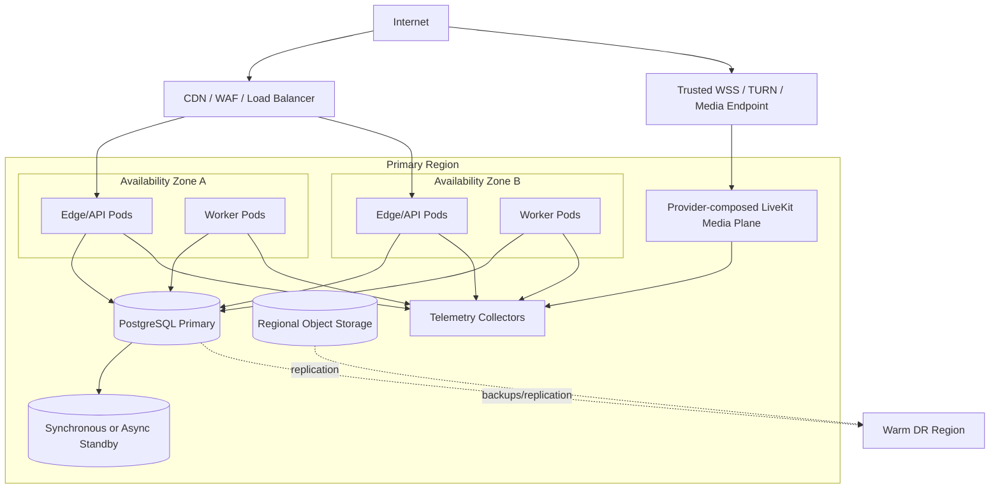

# Deployment View

The production design must tolerate loss of one application instance and one
availability zone without losing acknowledged messages, subject to the
approved database replication mode. Audio/video production activation
additionally requires a separately qualified media endpoint with trusted WSS,
ICE/UDP, ICE/TCP, restricted TURN/TLS, bandwidth and group-capacity evidence,
privacy approval, and failure evidence. A media outage degrades calls but must
not make durable text messaging unavailable. The portable application overlay
references this external boundary and does not deploy LiveKit or TURN.
