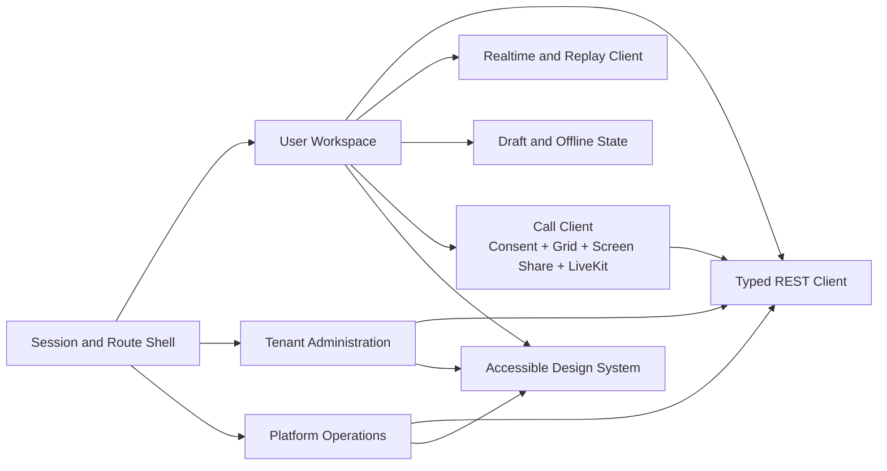

# C4 Level 3 — Web Product Components

## Rules

- The server-provided identity and permission set controls available routes and
  actions; hidden controls are not an authorization boundary.
- Durable messages and read state reconcile from server cursors after every
  reconnect. Local drafts and retries never become authoritative history.
- The user workspace may render authorized message content. Tenant-admin and
  operations queries return only the content required by their explicit policy.
- Shared API, error, loading, keyboard, focus, responsive, and accessibility
  behavior belongs in the shell/design platform rather than each feature.
- Camera, microphone, and screen capture begin only after explicit user
  actions. Camera and microphone default off in the video prejoin surface;
  screen sharing has a separate visible start/stop action. Join credentials
  remain in memory, the responsive grid represents participants without fake
  feeds, and all local/remote tracks are detached on leave, end, session loss,
  native screen-track end, or component teardown.
