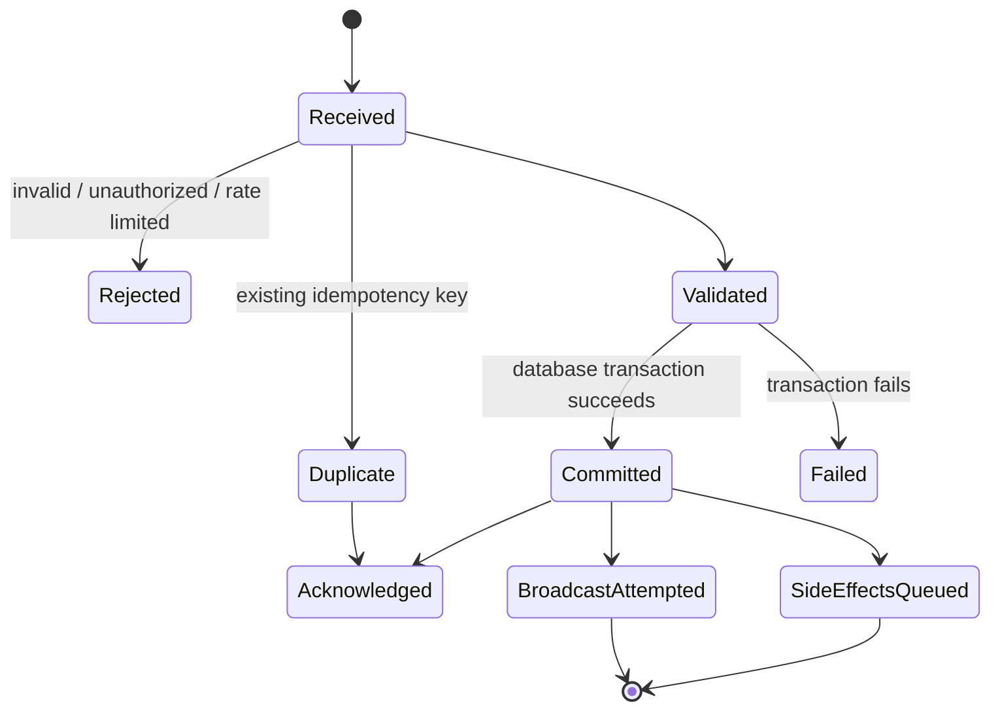

# Message Lifecycle

## Commit transaction

- Allocate conversation sequence.
- Insert message and associated metadata.
- Validate and attach ready attachments.
- Insert mentions and audit event.
- Insert job/outbox records.

The live broadcast and external side effects execute only after the transaction is known to have committed.
