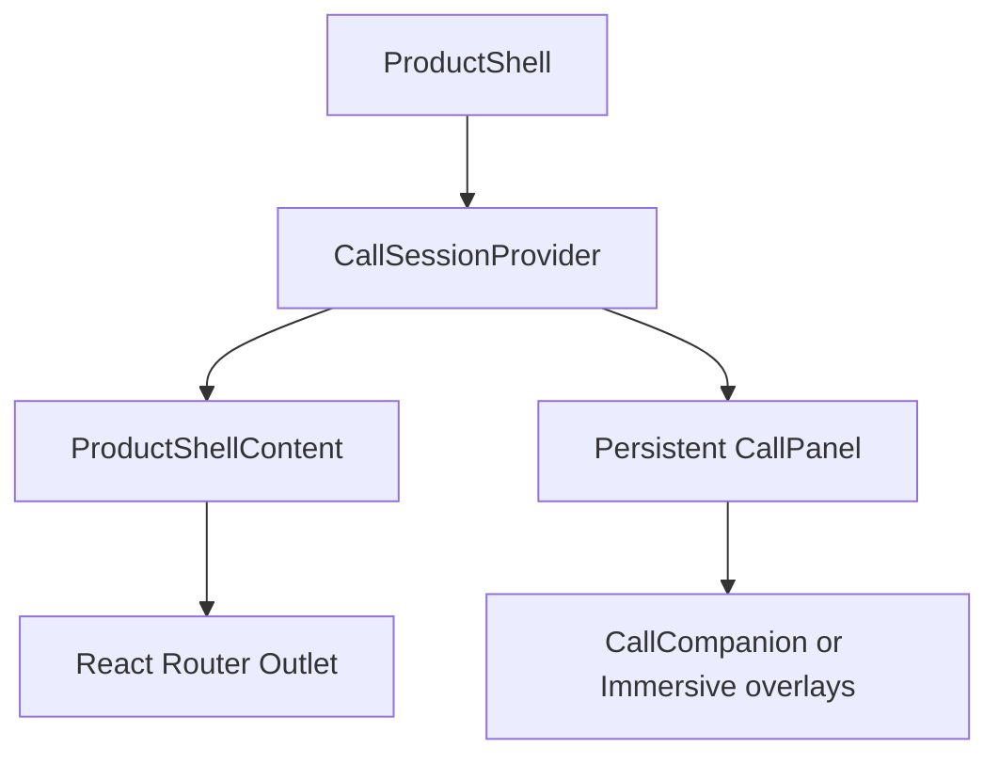

# K-Comms Immersive UI Implementation Reference v6

**Status:** Companion implementation reference  
**Date:** 27 August 2026  
**Authoritative product contract:** [K-Comms Immersive Full-Canvas UI Engineering Prompt v6](../01-product-and-scope/K-Comms_Immersive_Full-Canvas_UI_Engineering_Prompt_v6.md)  
**Operations companion:** [K-Comms Immersive UI Operations Runbook v6](../14-operations/K-Comms_Immersive_UI_Operations_Runbook_v6.md)

This document explains how to implement the contract in the shipped React client. If this reference conflicts with the product contract, the contract wins. Verify every named path against the checked-out branch before editing.

---

## 1. Verified starting topology

The first increment is a presentation and interaction change, not a client rewrite.

| Concern | Verified implementation | Engineering action |
| --- | --- | --- |
| Browser shell | `clients/web`, React Router, Vite, TypeScript | Extend in place |
| Authenticated route lifetime | `ProductShell` mounts `CallSessionProvider`; `ProductShellContent` renders `<Outlet />` inside it | Preserve topology |
| Persistent call UI | `CallSessionProvider.tsx` lazy-loads `CallPanel` as `PersistentCallPanel` | Audit and extend into `CallCompanion` |
| Drag behavior | `DraggableSurface.tsx` uses pointer capture | Add constraints/presets only where missing |
| Room/media hook | `useLiveKitRoom.ts` owns the current room, adaptive stream, and `Track.attach()` | Keep as the single room hook |
| Authenticated capability inputs | `/api/v1/status.capabilities` and `MeResponse.capabilities: UserCapabilities` | Extend existing types and selector |
| Guest capability input | `GuestSession.capabilities: GuestCapabilities` | Add surface eligibility here if required |
| Instant-room capacity input | `InstantRoom` and `InstantRoomPreview` include `participant_limit` | Render server value; do not recompute policy in React |
| Standalone whiteboard | `WhiteboardPage` → `CollaborativeWhiteboard` → `KCommsDrawingCanvas`; existing Excalidraw canvas and controls | Preserve and register protected collision zones |
| Test stack | Vitest/jsdom; Playwright `chromium`, `chromium-dark`, `mobile-chromium`, `webkit`; axe | Add tests to this matrix |



Do not move `CallSessionProvider` below the outlet. Do not add another provider above it. Do not instantiate a second media hook merely to render an alternate presentation.

## 2. Proposed client boundaries

Use names consistent with the repository; adapt if an equivalent already exists.

```text
CallSessionProvider              Existing lifetime and teardown authority
  CallPresentationCoordinator   New selector/reducer orchestration only
    ActiveContentStage          Viewport-filling content plane
      CallMediaStage            Existing attached LiveKit media DOM
      ScreenShareStage          contain-fit presentation
      InCallWhiteboardStage     Existing collaboration session presented in-call
    OverlayLayer                Fixed presentation plane; no stage layout effect
      CriticalStatusStrip       Never-hidden safety/privacy state
      CallControlDock           Expanded/minimized existing controls
      ParticipantOverlay        List/grid context, virtualized when large
      InCallChatOverlay         Existing authorized message functions
      CaptionRegion             Highest collision priority
    CallCompanion               Existing persistent panel on Workspace routes
```

### 2.0 Where these names actually live

The boundaries above are roles, not a required file layout -- §2 says to adapt
where an equivalent already exists, and for most of them one did. Mapping them
to the code as shipped, so that reading the contract and grepping the
repository agree:

| Boundary | As shipped |
| --- | --- |
| `CallPresentationCoordinator` | `features/experience/ExperienceModeProvider.tsx`, with the reducer in `experience-mode.ts` and the selector in `immersive-eligibility.ts` |
| `ActiveContentStage` | Not a component. The existing `.audio-call-dock` restyled by `experience-mode.css` under `:root[data-experience-mode="immersive"]` -- see §2.1, which forbids re-parenting the media DOM |
| `CallMediaStage` / `ScreenShareStage` | The existing `.call-stage` and `.video-track-frame.screen-share`; the share already fits with `contain` |
| `CriticalStatusStrip` / `CallCompanion` | The capsule in `CallPanel.tsx` -- `.call-critical-status`, `.call-critical-state`, `.call-critical-actions`. It renders only while the panel is minimized, which is the Workspace-route case the companion exists for |
| `CallControlDock` | The existing `.audio-call-dock-heading` and `.audio-call-actions`, absolutely positioned in Immersive so neither consumes stage layout space |
| `OverlayLayer`, `ParticipantOverlay`, `InCallChatOverlay`, `CaptionRegion` | Not yet built |

### 2.0.1 Where the required fixtures live

The contract makes every acceptance criterion depend on a fixture, and says
plainly that a missing fixture is a failed gate rather than a waived criterion.
This is the inventory, so that a reviewer can check a row rather than search for
it.

| Contract fixture row | Implemented as |
| --- | --- |
| Experience reducer and overlay component | `features/experience/experience-mode.test.ts`, `useOverlayVisibility.test.tsx`, `useOverlayPlacement.test.tsx`, `overlay-placement.test.ts` |
| Existing provider/panel continuity | `features/calls/CallSessionProvider.continuity.test.tsx` |
| Guest and instant-room joined call | `features/experience/guest-immersive.test.tsx`, plus `guest_communication/immersive_capability_test.exs` server-side |
| Instant-room effective limit | Pre-existing `comms_core` admission tests; the UI consumes the server limit and does not recalculate it |
| 1/4/16/49 synthetic tiles | `e2e/participant-grid.spec.ts` |
| Whiteboard + active-call collision | `features/experience/companion-collision.test.ts`, and the yield assertions in `features/calls/CallPanel.layout-reconnect.test.tsx` |
| Concurrent call | `features/calls/call-switch.test.ts`, `CallSessionProvider.switch.test.tsx` |
| Capability deadline and fail-closed | `features/experience/ExperienceModeProvider.test.tsx`, `immersive-eligibility` cases in `experience-mode.test.ts` |
| Four-project browser matrix and axe/forced-colors | `e2e/immersive-stage.spec.ts` (axe and forced colors), run across `chromium`, `chromium-dark`, `mobile-chromium`, `webkit` |
| Rollback rehearsal | `features/experience/emergency-disable.test.tsx` for the client half; the deployment half remains with Release Engineering |

Measured budgets are in `e2e/immersive-performance.spec.ts`, which records the
browser, platform, viewport, core count and throttle setting alongside each
result so a run on another machine is comparable.

Two budgets in §8.2 are **not** covered there, and the omission is deliberate:
drag frame rate under throttling, and "no API/Channel message or analytics
event per pointer frame". Both were written against the static stage fixture
and both passed while measuring nothing -- that fixture's placement handle is
markup with no hook behind it, so a synthesized drag moves the panel zero
pixels. They need a real joined call on the reference device, which is the
Media/Realtime owner's half of the row. A test that reports a budget as met
without exercising it is worse than an absent one.

### 2.1 DOM stability

- Keep the media element tree stable across overlay show/hide, minimization, drag, Workspace navigation, and re-entry into Immersive Mode.
- Presentation wrappers may change class/state; attached `<video>`/`<audio>` nodes, room identity, local publications, and the `useLiveKitRoom.ts` instance must not be recreated.
- Use a portal only if it preserves element identity and focus order. A portal is not permission to create another media tree.
- Keep high-frequency pointer coordinates in refs. Commit React state only on semantic changes: visibility state, minimized state, snap result, preset selection, or drag completion.
- Attach global listeners once per active presentation and clean them deterministically.

## 3. Explicit state model

### 3.1 Experience reducer

```ts
export type ExperienceMode = "workspace" | "focus" | "immersive";

export type ExperienceEvent =
  | { type: "JOINED_CALL" }
  | { type: "OPENED_WORKSPACE_ROUTE" }
  | { type: "RETURNED_TO_CALL" }
  | { type: "CALL_ENDED" }
  | { type: "ENTER_FOCUS"; authorized: boolean }
  | { type: "EXIT_FOCUS" };
```

Rules:

- `JOINED_CALL` and `RETURNED_TO_CALL` → `immersive`.
- `OPENED_WORKSPACE_ROUTE` while a call remains active → `workspace`; call state stays owned by the provider.
- `CALL_ENDED` → the current authorized non-call surface.
- `ENTER_FOCUS` → `focus` only when `authorized === true`; otherwise return current state without side effects.
- Do not derive experience state from scattered selectors such as `.call-open`, pathname fragments, or viewport width alone.

### 3.2 Control visibility state

Use explicit semantic states:

```ts
type ControlVisibility =
  | "expanded"
  | "pinned"
  | "interacting"
  | "compact"
  | "blocked";
```

Recommended transitions:

| Event | Result |
| --- | --- |
| Meaningful pointer movement, stage tap, keyboard shortcut, focus enters | `expanded` |
| User pins controls or enables Always show | `pinned` |
| Drag, menu/dialog open, pending action, focus/hover within controls | `interacting` |
| Three seconds of eligible idle | `compact` |
| Permission, consent, reconnect, or destructive confirmation requires attention | `blocked` |

Never collapse while focus is within the controls, while a menu/dialog is open, while dragging, while a request is pending, or while a blocking failure is active.

### 3.3 Meaningful motion filter

- Listen locally to `pointermove` only while the stage is active.
- Ignore movement below a small accumulated threshold, e.g. 6 CSS px over 100 ms, to prevent jitter from resetting idle state.
- Ignore movement originating inside a playing video element when coordinates remain effectively stationary.
- Use one `requestAnimationFrame` gate for DOM transform updates during drag.
- Do not emit analytics for reveal attempts or drag frames. Emit at most one semantic event at reveal completion or drag completion, subject to privacy review.

The 6 px/100 ms values are initial engineering constants, not product truth. Record them as named tokens and validate with trackpad, mouse, stylus, and touch input.

## 4. Capability integration and join boundary

### 4.1 Use existing inputs

The current client already has two adjacent capability layers:

- `/api/v1/status.capabilities` supplies service availability/readiness such as `audio_calls`, `video_calls`, `whiteboards`, and `instant_rooms`.
- `/api/v1/me` supplies authenticated `UserCapabilities`, including call entitlements and tenant/user policy.

Guest sessions already carry `GuestCapabilities`; instant-room preview/session responses already carry surface data. Extend these existing response/type families as needed.

Semantic fields, as shipped:

```ts
interface ServiceStatusCapabilities {
  immersive_mode?: boolean; // global service switch / emergency disable input
}

interface UserCapabilities {
  allow_immersive_mode?: boolean; // authenticated tenant/user cohort entitlement
}

interface GuestCapabilities {
  allow_immersive_mode?: boolean; // guest-surface entitlement, if separately controlled
}
```

These names were recommended here as `immersive_call_ui` and deliberately
changed to follow the conventions of the responses they join, per §2's
instruction to use names consistent with the repository. `status.capabilities`
carries bare nouns -- `audio_calls`, `video_calls`, `whiteboards`,
`instant_rooms` -- and `immersive_call_ui` would have been its only `_ui`
suffix. `UserCapabilities` and `GuestCapabilities` prefix entitlements with
`allow_` -- `allow_audio_calls`, `allow_video_calls`, `allow_public_channels` --
and an unprefixed field would have read as state rather than permission.

The guest field is listed for completeness; guest and instant-room entry are
not wired in the first increment.

An instant-room eligibility field should be added to its existing preview/session payload only if public sessions require independent rollout targeting. Do not invent a general-purpose second status endpoint.

### 4.2 One eligibility selector

```ts
type EligibilityInput = {
  serviceEnabled: boolean | undefined;
  surfaceEnabled: boolean | undefined;
};

export function selectImmersiveEligibility(input: EligibilityInput): boolean {
  return input.serviceEnabled === true &&
    input.surfaceEnabled === true;
}
```

For authenticated users, `surfaceEnabled` comes from `UserCapabilities`. For guests/instant rooms, it comes from the existing surface/session response. Emergency disable makes the existing service capability evaluate false; it is not a third client-side flag channel. Missing values fail closed.

Keep this selector pure and testable. Do not let route components implement slightly different Boolean logic.

### 4.3 Evaluation deadline

1. Prefetch service and surface capability state as soon as prejoin renders.
2. Record a monotonic capability request start time.
3. If state is ready before Join, choose the presentation immediately.
4. If Join occurs while state is pending, wait no more than 300 ms.
5. At the deadline, dispatch media connection using the resolved choice: Immersive only for an explicit positive; otherwise legacy.
6. Freeze the choice before the LiveKit connect action is dispatched.
7. A positive result that arrives after connect begins is retained for the next eligible call but cannot upgrade the active call.

Test with fake timers and a controlled deferred promise. Cover positive at 0 ms, positive at 299 ms, unresolved at 300 ms, positive after 300 ms, denied, malformed, and rejected fetch.

## 5. Active-content stage and overlay plane

### 5.1 Stage sizing

```css
.active-content-stage {
  position: fixed;
  inset: 0;
  width: 100dvw;
  height: 100dvh;
  min-width: 0;
  min-height: 0;
  overflow: hidden;
}

.immersive-overlay-layer {
  position: fixed;
  inset: 0;
  pointer-events: none;
}

.immersive-overlay-layer > * {
  pointer-events: auto;
}
```

Provide tested `100vw`/`100vh` fallbacks behind feature queries. When `window.visualViewport` exists, use its `width`, `height`, `offsetTop`, and `offsetLeft` for interactive bounds; media may extend behind browser/safe-area chrome.

### 5.2 Fit policy

- Remote camera: `object-fit: cover` by default, with a user-selectable contain option.
- Local camera preview: cover within its own floating rectangle.
- Screen share, documents, spreadsheets, slides, code, and whiteboard presentation: `object-fit: contain` or the surface-native equivalent.
- Do not crop screen content merely to eliminate letterboxing.
- Preserve source aspect ratio. Never stretch video.

### 5.3 Overlay material

- Use translucent, blurred material only over a small surface area.
- Provide an opaque setting and automatic opaque fallback when contrast or frame timing is poor.
- Validate text/icon contrast over the darkest, lightest, and highest-detail media fixtures.
- In forced-colors mode, remove blur/translucency and use system colors/borders.

## 6. Overlay dragging, snapping, and collision

### 6.1 Reuse the primitive

Extend `DraggableSurface.tsx` rather than replacing it.

- Start drag only from the handle or a designated non-control region.
- Call `setPointerCapture(pointerId)` after a valid drag threshold.
- Write movement with `transform: translate3d(...)` inside one animation-frame loop.
- Do not read layout after writing layout in the same frame.
- Commit snap/persistence only at drag end.
- Restore focus to the dragged surface or logical trigger after a keyboard/preset move.

### 6.2 Placement model

Persist normalized anchor/offset data:

```ts
type OverlayPlacement = {
  anchor: "top-left" | "top-right" | "bottom-left" | "bottom-right";
  xRatio: number;
  yRatio: number;
  minimized: boolean;
  version: 1;
};
```

Clamp ratios to `[0, 1]`, validate stored data, and recover to a safe default if the surface no longer fits. Recompute after resize, zoom, orientation, safe-area, visual-viewport, PWA display-mode, and future fullscreen changes.

### 6.3 Collision registry

Use one registry of protected rectangles and priorities. Do not scatter one-off offsets through CSS.

```ts
type CollisionZone = {
  id: string;
  rect: DOMRectReadOnly;
  priority: number;
  active: boolean;
};
```

Priority order:

1. blocking permission/consent/destructive confirmation;
2. captions;
3. whiteboard text editor, pen/stylus active plane, native Excalidraw toolbars/menus/dialogs/zoom/collaborator controls;
4. Stop Sharing/Stop Presenting and critical call status/actions;
5. routine panels, filmstrip, notifications.

If no valid floating position remains, collapse to the critical-status capsule; never overlap a higher-priority zone to preserve a cosmetic layout.

### 6.4 Non-drag alternatives

Provide a placement menu with at least four corners, Restore default, Minimize/Expand, and Always show controls. Provide keyboard movement in coarse steps with documented shortcuts only when those shortcuts do not conflict with browser or assistive technology behavior.

## 7. Call continuity across routes

The existing provider already survives authenticated route changes. Work from that fact.

| Transition | Presentation result | Media result |
| --- | --- | --- |
| Prejoin → joined call | Immersive or legacy from sticky capability decision | Connect once |
| Joined call → authenticated Workspace route | Workspace + existing panel extended as `CallCompanion` | Same room, tracks, publications |
| Workspace + active call → Return to call | Immersive | Same room; no second hook |
| Browser Back while call active | Route changes only | No implicit media mutation |
| Remote end while on Workspace route | Remove companion, show truthful reason | Teardown once |
| Logout | Navigate only after teardown authority resolves | Teardown once |
| Phoenix reconnect while media remains live | Show product-state reconnect status | Do not reconnect LiveKit unnecessarily |
| Media reconnect while Phoenix remains live | Show media reconnect status | Preserve product route/session |

`CallCompanion` minimum actions/state:

- Return to call;
- microphone state/action;
- camera state/action;
- sharing state with direct Stop Sharing while active;
- recording/consent state where applicable;
- connection/reconnect state;
- accessible Leave/End action;
- current conversation identity without leaking unauthorized participant data.

## 8. Guest, instant-room, and concurrent-call implementation

### 8.1 Guest

- Enter Immersive inside the guest topology; do not mount `ProductShellContent`.
- Filter actions by `GuestCapabilities` and server authorization.
- Leaving returns to the existing authorized guest conversation, conversion prompt, or terminal state.
- A converted/authenticated user may enter the member flow only after the existing conversion/session boundary succeeds.

### 8.2 Instant room

- Enter Immersive inside `InstantRoomPage` and its existing session hook.
- Preserve public-route idempotency, preview, admission, creator/participant identity, and terminal state.
- Use the server-returned `participant_limit` in copy and UI. React must not hard-code `25` or query tenant policy.
- Do not render authenticated mobile navigation or authenticated `CallCompanion`.

### 8.3 Concurrent calls

The inbox may discover several active conversation IDs, but the browser supports one foreground joined room in this increment.

- A second incoming/active call creates a notification only.
- Accepting it opens a confirmation: switching leaves the current call.
- Disable repeated accepts while current leave is pending.
- Join the second call only after current leave is acknowledged/reconciled by the single authority.
- On leave failure/timeout, remain truthful: current call stays selected, second join does not begin, and the user sees an actionable state.
- Decline/dismiss never mutates the current room.

## 9. Whiteboard-specific behavior

### 9.1 Verified layout constraints

The current standalone route is already a near-full content surface:

- `.whiteboard-page` is a two-row grid with a 56 px heading and the canvas below;
- `.whiteboard-room` is a clipped relative container;
- `.whiteboard-canvas` flexes into the remaining region;
- `CollaborativeWhiteboard` uses Excalidraw plus product `CanvasControls`;
- compact whiteboards already use a draggable status surface.

Therefore, adding an unconstrained second floating call panel is not routine.

### 9.2 Standalone whiteboard + active call

Preferred placement sequence:

1. Use available `.whiteboard-heading` or shell-edge chrome without covering the conversation selector.
2. If it fits, render a collapsed companion/status capsule in the top safe-area region outside registered native controls.
3. When pen/stylus interaction begins or Excalidraw text editing is active, collapse routine companion UI immediately; keep only critical state/actions in a protected non-canvas location.
4. If no protected location exists at the current visual viewport, expose call controls through an explicit top-safe-area launcher and accessible shortcut rather than covering the drawing plane.

Register and update collision rectangles through refs/observers. Do not rely on hard-coded guesses about Excalidraw’s internal toolbar dimensions.

### 9.3 In-call whiteboard

- Render the existing collaboration scene/session as `ActiveContentStage` content.
- Use one Immersive overlay layer and one critical status strip.
- Stop Presenting/Stop Sharing remains directly operable.
- Captions outrank every movable control.
- Do not mount Workspace `CallCompanion` in parallel.

## 10. Media and device behavior

- Continue direct browser-to-LiveKit connection using short-lived Phoenix-issued scoped tokens.
- Continue `Track.attach()` on stable media elements and adaptive stream/dynacast behavior already present.
- Overlay changes must not call publication APIs, replace tracks, or trigger SDP renegotiation.
- Distinguish permission denied, ignored, policy-blocked, absent, and device-busy states.
- Reconcile `devicechange` when a selected device disappears.
- Browser-ended screen share must immediately clear sharing state and surface the truthful reason.
- Mute, Stop Sharing, Leave, and permission response must execute before or independently of presentation animation.
- Remote call end and terminal disconnect must flow through the single teardown authority.

Fullscreen, PiP, and Wake Lock remain future increments. If later approved, implement feature detection, user-activation requirements, lifecycle reconciliation, and a fully usable in-tab fallback. Never make their absence a call blocker.

## 11. Responsive and mobile rules

- Use the visual viewport for overlay bounds when supported.
- In mobile Immersive Mode, hide the authenticated 60 px bottom navigation; it is restored on Workspace routes.
- Do not render both Immersive controls and `CallCompanion` on the same mobile route.
- On a Workspace route with an active call, position the companion above the bottom navigation and keyboard; when space is insufficient, collapse it into the top safe-area critical strip.
- Primary mobile targets are at least 48 × 48 CSS px.
- Test 390 × 844 CSS px in portrait, landscape, browser-chrome expanded/collapsed, and keyboard open/closed.
- Guest and instant-room calls never synthesize the authenticated bottom navigation.

## 12. Accessibility implementation

- Use a labeled `role="toolbar"` for grouped call controls and roving tabindex/arrow-key behavior consistent with WAI-ARIA toolbar guidance.
- Dialogs move focus to a meaningful initial control, contain focus while modal, close with Escape when safe, and return focus to the opener.
- State buttons expose action plus state: “Mute microphone, currently unmuted,” not only “Microphone.”
- Critical changes use appropriate live regions without announcing every network tick.
- Preserve focus while controls reveal/hide; compacting must not remove the currently focused element.
- Provide opaque/high-contrast and Always-show preferences.
- Reduced motion disables movement and snapping animation.
- Forced-colors mode uses system colors and visible boundaries; do not depend on translucency or color alone.
- Accessibility summaries for whiteboard content remain present; do not mark the canvas as decorative.

## 13. Test and fixture plan

### 13.1 Unit/component tests — Vitest/jsdom

- experience reducer, including unreachable Focus transition;
- control visibility and keep-visible conditions with fake timers;
- meaningful-motion threshold and no per-frame analytics;
- eligibility selector and 300 ms decision deadline;
- late-positive stickiness;
- drag handle, pointer capture, clamp, normalized persistence, preset, and keyboard placement;
- collision registry and no-valid-position collapse;
- teardown authority idempotence;
- current panel extended rather than duplicate panel rendered;
- instant-room copy uses server `participant_limit`.

### 13.2 Backend/domain tests

Create explicit instant-room admission fixtures:

| Global ceiling | Tenant policy | Effective boundary | Required assertion |
| ---: | ---: | ---: | --- |
| 25 | 10 | 10 | 10 accepted; 11 rejected |
| 25 | 25 | 25 | 25 accepted; 26 rejected |
| 25 | 40 | 25 | 25 accepted; 26 rejected |

The domain fixture must assert the authoritative rejection reason. Browser tests may mock/render that response but must not substitute for the domain boundary test.

For authenticated calls, first identify the actual authoritative admission policy and test that policy. Do not infer a call maximum from the UI grid fixture.

### 13.3 Synthetic media/layout fixtures

Provide deterministic 1, 4, 16, and 49 tile sets with controllable aspect ratios, names, camera-off states, active speaker, screen share, and captions. The 49-tile fixture measures layout and performance only.

### 13.4 Playwright matrix

Run the repository projects:

- `chromium`;
- `chromium-dark`;
- `mobile-chromium`;
- `webkit`.

Cover:

- Workspace → Immersive → Workspace + companion → return;
- guest and instant-room topology isolation;
- whiteboard collision with call, text editing, pointer/stylus simulation where available, and keyboard;
- 390 × 844 keyboard composition;
- second-call accept/decline and failed leave;
- capability positive, timeout, late positive, denied, and emergency disabled;
- stage bounding box before/after overlay transitions;
- axe checks, dark palette, reduced motion, zoom/reflow, and explicit forced-colors coverage.

### 13.5 Performance evidence

Save traces for reference and 4× CPU-throttled runs. Include stage rectangles, `layout-shift` observer output, interaction timings, drag frame samples, React profiler evidence, network/Channel/analytics counts during drag, and media connection/publication counts across route changes.

## 14. Engineering sequence

1. Record the implementation branch’s actual test baseline and locate current equivalents of every named file.
2. Add existing-channel capability fields, pure selector, prejoin fetch, deadline, and legacy decision tests.
3. Add the experience reducer without making Focus reachable.
4. Stabilize the media DOM and add the `ActiveContentStage`/overlay plane.
5. Extend existing call panel/minimized state/drag primitive; do not replace them.
6. Implement route continuity and `CallCompanion` gaps.
7. Implement guest, instant-room, concurrent-call, mobile, and whiteboard contracts.
8. Build all required fixtures and run Vitest/Playwright/axe/performance gates.
9. Qualify enabled/disabled paths and follow the Operations Runbook.

## 15. Primary technical references

Use current primary sources during implementation:

- MDN: CSS dynamic viewport units and [`VisualViewport`](https://developer.mozilla.org/en-US/docs/Web/API/Visual_Viewport_API)
- MDN: [Pointer capture](https://developer.mozilla.org/en-US/docs/Web/API/Element/setPointerCapture)
- MDN: [`prefers-reduced-motion`](https://developer.mozilla.org/en-US/docs/Web/CSS/@media/prefers-reduced-motion)
- MDN: [`forced-colors`](https://developer.mozilla.org/en-US/docs/Web/CSS/@media/forced-colors)
- W3C WAI-ARIA APG: [Toolbar pattern](https://www.w3.org/WAI/ARIA/apg/patterns/toolbar/)
- W3C WAI-ARIA APG: [Dialog modal pattern](https://www.w3.org/WAI/ARIA/apg/patterns/dialog-modal/)
- WCAG: [Target Size (Minimum)](https://www.w3.org/WAI/WCAG22/Understanding/target-size-minimum.html)
- LiveKit docs: [Rendering tracks](https://docs.livekit.io/home/client/tracks/rendering-media/)
- LiveKit docs: [Adaptive stream](https://docs.livekit.io/home/client/tracks/subscribe/)
- React: [`useEffect`](https://react.dev/reference/react/useEffect) and [`useRef`](https://react.dev/reference/react/useRef)
- Playwright: [Projects](https://playwright.dev/docs/test-projects), [emulation](https://playwright.dev/docs/emulation), and [trace viewer](https://playwright.dev/docs/trace-viewer)
- Vitest: [Fake timers](https://vitest.dev/api/vi.html#vi-usefaketimers)

Repository implementation remains the source of truth for K-Comms-specific topology, limits, authorization, and behavior.
