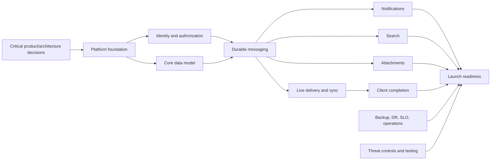

# Delivery Dependency Map

```mermaid
flowchart LR
    Decisions[Critical product/architecture decisions] --> Foundation[Platform foundation]
    Foundation --> Identity[Identity and authorization]
    Foundation --> Data[Core data model]
    Identity --> Messaging[Durable messaging]
    Data --> Messaging
    Messaging --> Realtime[Live delivery and sync]
    Messaging --> Notifications
    Messaging --> Search
    Messaging --> Attachments
    Realtime --> Clients[Client completion]
    Notifications --> Launch[Launch readiness]
    Search --> Launch
    Attachments --> Launch
    Clients --> Launch
    DR[Backup, DR, SLO, operations] --> Launch
    Security[Threat controls and testing] --> Launch
```
