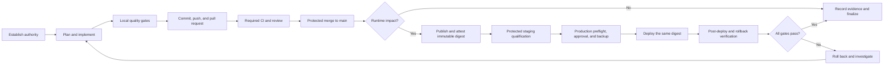

# Development-to-Production Completion Standard

Status: Required  
Applies to: K-Comms development, features, fixes, configuration, migrations,
security changes, infrastructure, and operational controls  
Runtime authority: `deploy/proxmox/inventory.json`, protected GitHub
environments, deployment receipts, and live verification  
Architecture authority: `docs/02-architecture/` and accepted ADRs

## Purpose

This standard converts completed development into a repeatable, evidence-backed
release. Work is not complete when code exists locally or local tests pass. It
is complete only when the applicable exit state below is reached and recorded.

Once acceptance criteria are met, the implementing agent continues through
each safe gate without waiting for another instruction. A new prompt is not
required between local validation, source-control publication, CI, merge,
staging, production promotion, verification, and final reporting.

Required reviews, protected-environment approvals, and fail-closed gates remain
mandatory. This standard never authorizes bypassing them.

## Change classification and exit state

| Change class | Examples | Required exit state |
|---|---|---|
| Documentation/governance only | Markdown, diagrams, templates, non-runtime policy | Protected merge, documentation checks green, clean handoff |
| Development tooling/test only | Test harness, linter, developer script with no runtime effect | Protected merge, relevant CI green, clean handoff |
| Runtime feature or defect fix | Backend, web client, API, job, realtime behavior | Same immutable digest qualified in staging and production |
| Database/data change | Migration, ownership, retention, backfill | Runtime path plus compatibility, backup, migration, reconciliation, and rollback evidence |
| Security/identity/secrets change | Authentication, authorization, keys, trusted edge | Runtime path plus security review, negative controls, rotation/recovery evidence |
| Infrastructure/operations change | Quadlet, systemd, network, firewall, backup, tunnel | Runtime path plus host validation and reboot recovery when startup behavior changes |
| Emergency change | Active incident mitigation | Smallest safe fix, recorded exception, immediate verification, then normal retrospective gates |

When a change spans classes, apply the strictest exit state. A change is
local-only, draft-only, or staging-only only when the user explicitly says so.

## Standard state flow



## Gate 0: establish authority

Before editing:

1. Confirm the repository root, current branch, target branch, and remote.
2. Read `AGENTS.md`, the relevant architecture documents, ADRs, runbooks, and
   tests.
3. Inspect the worktree. Preserve unrelated user changes and use a clean
   worktree when the active checkout is dirty.
4. Confirm the active development runtime and deployment targets from
   repository inventory and live evidence.
5. Record the current production image, revision, receipt, service health,
   authoritative storage identity, and rollback target when runtime work is
   planned.
6. Define acceptance criteria, risk, observability, migration, rollout, and
   rollback before implementation.

Do not act from remembered topology or an old chat transcript when current
repository or runtime evidence is available.

## Gate 1: implement a focused change

1. Branch from current protected `main`.
2. Keep one change focused on one outcome.
3. Reuse existing architecture and implementation patterns.
4. Update behavior tests with the implementation.
5. Update contracts, schemas, migrations, telemetry, runbooks, and user
   documentation when affected.
6. Add or update an ADR for material architecture, security, data, public API,
   integration, or deployment-topology decisions.
7. Never hard-code secrets or weaken a security/recovery control to make a
   test pass.

## Gate 2: local qualification

Run the narrow tests during development, then the repository gates applicable
to the final diff. The normal baseline is:

```text
make check
make contracts
make docs-check
```

Also run the relevant formatter, compiler with warnings as errors, unit and
integration tests, migration checks, architecture validator, security tools,
web build/end-to-end tests, container build/smoke test, and Proxmox bundle
validator when their paths are affected.

For user-facing behavior, verify the active local runtime rather than relying
only on source tests. Record exactly what passed and anything not applicable.

No known failing test is accepted as “pre-existing” without evidence that it
also fails on the immutable base revision and does not affect the change.

## Gate 3: source-control delivery

1. Review the final diff and exclude secrets, credentials, runtime state,
   temporary evidence, and unrelated changes.
2. Commit intentionally on the task branch.
3. Push the branch and open or update a pull request using the repository
   template.
4. Include scope, architecture impact, validation, risk, migration, rollout,
   rollback, and evidence.
5. Wait for every required status check and review. Diagnose and correct real
   failures. Rerun only demonstrated infrastructure flakes.
6. Never bypass branch protection or merge with a required failure.
7. Merge through the protected branch and delete the delivery branch when safe.

## Gate 4: immutable artifact and supply-chain evidence

For runtime-impacting changes:

1. Use the publication workflow triggered from protected `main`.
2. Record the full merge commit and registry digest.
3. Require the application image to be referenced by digest, never `latest` or
   a mutable tag.
4. Verify the SLSA provenance and CycloneDX SBOM attestations against
   `Soyuz-Tec/k-comms/.github/workflows/container.yml`.
5. Treat the verified digest as the only candidate. Do not rebuild separately
   for staging or production.

## Gate 5: protected staging qualification

Deploy the candidate digest through the protected `staging` GitHub environment.
Staging must use synthetic data and staging-only credentials.

Required evidence:

1. Expected digest and revision are running.
2. Services, containers, health, readiness, and required public/LAN routes pass.
3. Migrations complete and backward compatibility is preserved.
4. Authentication, messaging, realtime delivery, replay, attachments, and the
   changed feature pass their applicable smoke/acceptance tests.
5. A quiesced application backup is created and its checksums, PostgreSQL dump,
   and MinIO archive validate.
6. Rollback to the previous release is rehearsed, then the candidate is
   reactivated and reverified.
7. Restore is rehearsed with synthetic staging data when data or recovery
   behavior changed.
8. VM reboot recovery is proven when systemd, Quadlet, firewall, network,
   tunnel, timers, storage identity, or host tuning changed.

Any failed staging gate blocks production.

## Gate 6: production preflight and approval

Immediately before promotion:

1. Confirm the candidate is the exact staging-qualified digest.
2. Re-read current production receipt, image, revision, storage volumes,
   service state, backup timers, tunnel, firewall/listeners, and health.
3. Capture authoritative record counts or other reconciliation markers without
   exposing sensitive data.
4. Confirm rollback identity and that its image remains available.
5. Create a fresh quiesced backup and validate checksums plus archive
   readability.
6. Obtain the protected `production` environment approval. Do not bypass an
   approval that requires a separate authorized reviewer.
7. Stop if unexpected drift, an unverified backup, missing attestation, an
   unavailable rollback target, or degraded health is found.

## Gate 7: production promotion

1. Deploy through the reviewed workflow and protected production environment.
2. Deploy the same immutable digest qualified in staging.
3. Run migrations using the documented compatible sequence.
4. Keep Cloudflare ingress and application lifecycle decoupled as defined by
   the Proxmox contract.
5. Do not reinitialize, rename, copy, or replace authoritative production
   volumes during a normal application update.
6. Let the deployment script fail closed and invoke the recorded rollback when
   activation or verification fails.

## Gate 8: post-deployment verification

Verify and record:

1. Deployment receipt, exact image digest, revision, environment, and storage
   identity.
2. Quadlet/systemd units, container health, Cloudflare connector, health and
   backup timers, and firewall service.
3. Local origin health plus every configured public application, media, and
   object-storage health endpoint.
4. Expected listeners: application, object storage, and signaling bound to
   loopback where designed; media ports restricted to the approved LAN;
   PostgreSQL not publicly exposed.
5. Authoritative counts/reconciliation markers compared with the immediate
   preflight. Explain legitimate live changes.
6. Logs and telemetry for startup errors, migration failures, security events,
   queue failures, and resource regressions.
7. A post-change quiesced backup when data, storage, migration, or recovery
   behavior changed.
8. Reboot recovery when the change affects boot ownership or host controls.

If a critical check fails, roll back first and investigate second.

## Gate 9: finalization

The implementing agent completes these steps without another instruction:

1. Confirm the pull request is merged and required checks are green.
2. Confirm the local operations worktree is clean and aligned with
   `origin/main`.
3. Update the changelog, release notes, runbook, ADR, or issue when applicable.
4. Record the merge SHA, image digest, workflow runs, staging evidence,
   production receipt, backup path, rollback identity, endpoints, and final
   counts.
5. Remove only known temporary artifacts; retain required receipts, backups,
   rollback images, and audit evidence.
6. Close or update the tracked issue.
7. Report the actual deployed outcome, verification, and remaining structural
   risks. Do not claim HA, off-site recovery, or PITR when those controls do not
   exist.

## Fail-closed rules

Do not continue to the next gate when:

- the repository/branch/runtime target is ambiguous;
- unrelated worktree changes would be overwritten;
- a required check, review, attestation, backup, restore, rollback, migration,
  security, or health gate fails;
- staging and production digests differ;
- production storage identity or record reconciliation is unexplained;
- secrets would be printed or committed;
- protected-branch or protected-environment controls would need bypassing;
- the action requires destructive data handling not explicitly authorized.

Correct an in-scope failure and resume the standard. Ask the user only when a
new material choice, new authority, destructive action, or external approval is
required.

## Completion evidence template

Use this compact record in the pull request, issue, or final handoff:

```markdown
## Completion evidence

- Change class:
- Acceptance criteria:
- Merge commit:
- Required checks:
- Image digest and attestations: N/A or links
- Staging deployment/receipt:
- Staging backup, restore, rollback, and reboot evidence:
- Production approval:
- Production deployment/receipt:
- Production backup:
- Pre/post reconciliation:
- Public and local health:
- Rollback identity:
- Documentation/ADR:
- Final worktree state:
- Remaining structural risks:
```

## Related authority

- [Proxmox deployment runbook](../../deploy/proxmox/README.md)
- [Release strategy](../10-infrastructure-and-deployment/release-strategy.md)
- [CI/CD design](../10-infrastructure-and-deployment/ci-cd.md)
- [Supply-chain integrity](../10-infrastructure-and-deployment/supply-chain-integrity.md)
- [Change management](change-management.md)
- [Backup and restore](../08-reliability/backup-and-restore.md)
- [Pull request checklist](../12-development-guides/pull-request-checklist.md)
- [Definition of Ready and Done](../13-delivery-plan/definition-of-ready-done.md)
