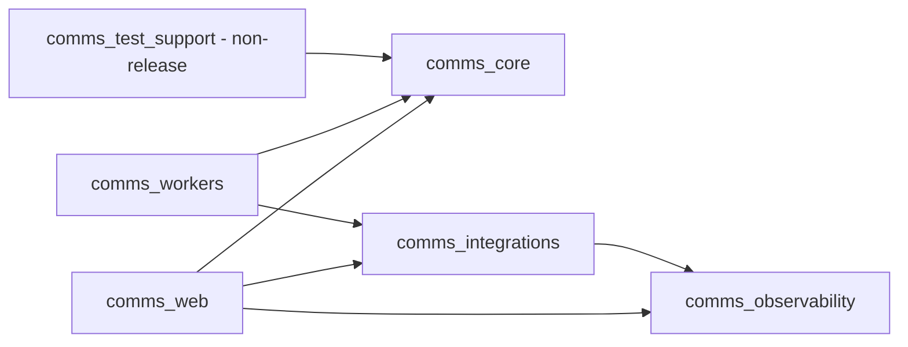
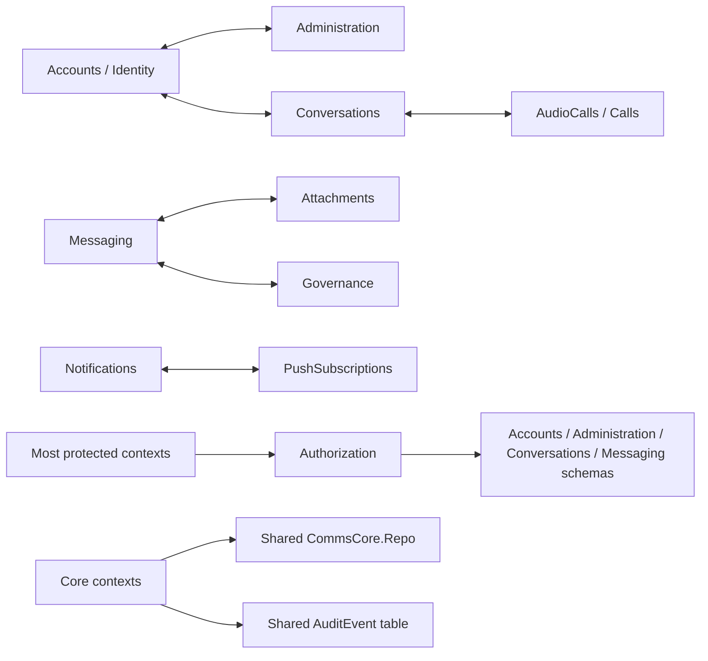

# Modular Monolith Structure Audit – 2026-07-15

Audit scope: the current working tree of `agent/mvp-staging-completion`, including its in-progress audio/video changes. The actual stack is an Elixir/Phoenix umbrella with Ecto/PostgreSQL and Oban, plus a React/TypeScript/Vite web client; it is a multi-tenant communications product, not the trading/BI example domain. The accepted architecture sources are `docs/02-architecture/architecture-overview.md`, `docs/02-architecture/adr/0001-modular-monolith.md`, and `docs/03-domain-and-data/domain-model.md`.

Size figures below are approximate physical source lines under production `lib/` trees. Public declaration counts include multi-clause `def` declarations, so they measure exposed surface rather than unique function names. The current core contains 36 Ecto schema declarations over 35 distinct domain tables because `users` is mapped twice. All 24 migrations are centralized in `apps/comms_core/priv/repo/migrations/`.

## 1. Executive Verdict

- **Overall rating: Needs Work**

**No, the codebase is not yet structured in the best way for a modular monolith with healthy business-module sizes.** It is a genuine single-deployment monolith with a clean, acyclic umbrella-application graph and strong containment of `CommsCore.Repo`; it is not a collection of microservices and is not an unstructured repository-wide big ball of mud. However, the umbrella boundaries separate technical layers and adapters, while nearly all business capabilities remain inside a roughly 15,000-line `comms_core` mini-monolith. Inside that app, contexts routinely import one another's Ecto schemas, join or mutate one another's tables, return persistence structs to adapters, and form cycles. The result is best described as an **umbrella-layered monolith with emerging Phoenix contexts**, not yet a hard-bounded, extraction-ready modular monolith.

## 2. Current Module Inventory

The inventory includes all six umbrella apps, the web-client package, every top-level `CommsCore` business context/facade, and grouped internal schema or technical modules. Nested Ecto modules are accounted for in their context rows rather than misrepresented as independent business modules.

### Umbrella applications and client package

| Module / Context Name | Business Capability | Approx Size (LOC or files) | Owns Own Tables? | Public API Exists? | Depends On (list) | Size Assessment (Too Small / Healthy / Too Large) | Notes |
|---|---|---:|---|---|---|---|---|
| `comms_core` | All domain rules, commands, schemas, persistence, events, and ports | 69 files / ~14,979 LOC | Physically yes; capability-exclusive ownership no | Yes; ~342 public declarations across the app | No umbrella app | Too Large | All business contexts and every migration are under `apps/comms_core/`; this is the central mini-monolith. |
| `comms_web` | Phoenix HTTP, WebSocket, authentication, presentation, and product delivery | 67 files / ~3,614 LOC | No | Yes; Phoenix routes/controllers/channels | `comms_core`, `comms_integrations`, `comms_observability` | Healthy | Controllers usually call core facades, but presenters import internal Ecto schemas (`apps/comms_web/lib/comms_web/presenter.ex:2-12`). |
| `comms_integrations` | LiveKit, object storage, notification, scanner, and webhook provider adapters | 24 files / ~2,254 LOC | No | Yes; adapter modules and behaviours | `comms_observability` | Healthy | Cohesive technical adapter app. The declared observability edge currently has no production `CommsObservability` source call. |
| `comms_workers` | Oban/background execution adapters | 9 files / ~505 LOC | No | Yes; worker entry points | `comms_core`, `comms_integrations` | Healthy | Correctly avoids Repo, but pattern-matches core Ecto structs (`attachment_worker.ex:5`, `notification_worker.ex:5`, `webhook_worker.ex:5`). |
| `comms_observability` | Framework-neutral telemetry and in-memory metrics | 3 files / ~141 LOC | No | Yes; `CommsObservability.execute/3` and metrics rendering | None | Healthy | Intentionally small technical leaf in `apps/comms_observability/lib/`. |
| `comms_test_support` | Non-release fixtures and test setup | 2 files / ~76 LOC | Test-only direct access | Yes; fixture helpers | `comms_core` | Healthy | Excluded from the release; its exact Repo exception is documented and allowlisted. |
| `clients/web` | Browser UI for user, admin, and operations surfaces | 78 TS/TSX files / ~12,025 lines | No | Yes; client components and API wrapper | Phoenix REST/WebSocket contracts | Healthy | Feature folders are `admin`, `auth`, `calls`, `chat`, `notifications`, `ops`, and `settings`; no frontend dependency-boundary lint exists (`clients/web/eslint.config.js`). |

### Business contexts and technical modules inside `comms_core`

| Module / Context Name | Business Capability | Approx Size (LOC or files) | Owns Own Tables? | Public API Exists? | Depends On (list) | Size Assessment (Too Small / Healthy / Too Large) | Notes |
|---|---|---:|---|---|---|---|---|
| `CommsCore.Accounts` | Tenant bootstrap, users, devices, sessions, invitations, platform access | 8 files / ~2,261 LOC | No | Yes; 33 facade declarations, 43 including schemas | Administration, Audit, Conversations, Governance, AdmissionQuotas, AudioCalls, Authorization, PushSubscriptions, Security, Repo | Too Large | Own namespace contains seven tables, but Accounts also writes `Administration.Invitation` and reads `Governance.DeletionRequest` (`accounts.ex:5-9`, `:757-840`, `:1460`). |
| `CommsCore.Administration` | Tenant settings, capabilities, invitations/audit reads | 3 files / ~475 LOC | No | Yes; 4 facade declarations | Accounts, Audit, AdmissionQuotas, AudioCalls, Authorization, RuntimePorts, Repo | Healthy | Logical tables are `tenant_settings` and `invitations`, but Accounts owns invitation workflows and several contexts read settings directly. |
| `CommsCore.AdmissionQuotas` | Tenant capacity locking and admission checks | 1 file / ~173 LOC | No tables | Yes; 7 declarations | Accounts, Administration, Conversations, Repo | Too Small | A policy slice over foreign tables, not an independently owned capability (`admission_quotas.ex:13-16`, `:89`, `:107-125`). |
| `CommsCore.Attachments` | Attachment intent, upload, scan, restore, download authorization | 4 files / ~1,015 LOC | No | Yes; 10 facade declarations | Administration, Audit, Authorization, Messaging, RuntimePorts, Repo | Healthy | Owns two schemas by namespace, but directly reads `Messaging.Message` (`attachments.ex:8`, `:263-268`) and Governance mutates attachment rows. |
| `CommsCore.AudioCalls` | Unified audio/video call lifecycle, admission, revocation, expiry/eviction state | 3 files / ~1,152 LOC | Mostly, but unenforced | Yes; 51 facade declarations / 22 unique exported names across the context | Accounts, Audit, Conversations, Authorization, Outbox, RuntimePorts, Repo | Too Large | One healthy capability with an oversized facade; it directly queries tenant, conversation, membership, session, and device data (`audio_calls.ex:637-679`). |
| `CommsCore.Audit` + `AuditExport` | Immutable audit evidence and export | 2 files / ~246 LOC | No | Partial; export exists, record facade does not | Authorization, Repo; direct callers throughout core | Too Small | `audit_events` is a shared-write table: at least 16 source files build `AuditEvent` directly; representative paths are `messaging.ex:429-430` and `authorization/database.ex:508-509`. |
| `CommsCore.Authorization` | Authorization port and database policy implementation | 3 files / ~557 LOC | No tables | Yes; one facade/behaviour plus database adapter callbacks | Accounts, Administration, Audit, Conversations, Messaging, Repo | Healthy | LOC is reasonable, but `authorization/database.ex:6-11` is a central schema-coupling point rather than a persistence-neutral policy boundary. |
| `CommsCore.Conversations` | Conversation lifecycle, membership, discovery, read cursors | 3 files / ~1,027 LOC | No | Yes; 15 facade declarations | Accounts, Administration, Audit, AdmissionQuotas, AudioCalls, Authorization, Outbox, Repo | Healthy | Owns two schema namespaces, but joins Users and is synchronously coupled to Calls (`conversations.ex:261`, `:379`, `:395-405`). |
| `CommsCore.Governance` | Retention, legal holds, deletion requests, erasure | 4 files / ~1,454 LOC | No | Yes; 17 facade declarations | Accounts, Administration, Attachments, Audit, Conversations, Messaging, AudioCalls, Authorization, RuntimePorts, Repo | Too Large | Its erasure implementation directly changes multiple foreign aggregates and tables (`governance.ex:815-940`). |
| `CommsCore.InAppNotifications` | User read/dismiss state for in-app notifications | 1 file / ~123 LOC | No | Yes; 5 declarations | Notifications, Repo | Too Small | Directly reads and updates `Notifications.Intent` (`in_app_notifications.ex:6-7`, `:27-62`). It belongs inside Notifications. |
| `CommsCore.Integrations` | Tenant webhook endpoint, subscription, secret, and delivery management | 5 files / ~1,024 LOC | Mostly, but Operations reads it | Yes; 14 facade declarations | Audit, Authorization, OutboxEvent, Security, RuntimePorts, Repo | Healthy | Owns four webhook tables by convention; the broad name is easily confused with the separate provider-adapter app. |
| `CommsCore.Messaging` | Messages, threads, mentions, revisions, reactions, search | 5 files / ~931 LOC | No | Yes; 12 facade declarations | Accounts, Conversations, Attachments, Governance, Audit, Authorization, Outbox, Repo | Healthy | Owns four tables by namespace, but joins Conversation/Membership/User and calls Attachments/Governance directly (`messaging.ex:174`, `:267-295`, `:390`, `:545-546`). |
| `CommsCore.Moderation` | Moderation cases and actions | 3 files / ~469 LOC | Mostly, but unenforced | Yes; 4 facade declarations | Accounts, Audit, Conversations, Messaging, Authorization, Repo | Healthy | Writes are localized, but validation reads User, Message, and Conversation schemas directly (`moderation.ex:197`, `:205`, `:215`). |
| `CommsCore.Notifications` | Preferences, delivery intents/attempts, recipient fanout | 6 files / ~938 LOC | No | Yes; 13 facade declarations | Accounts, Conversations, Audit, Authorization, PushSubscriptions, OutboxEvent, RuntimePorts, Repo | Healthy | Four logical tables are split among Notifications, InAppNotifications, and PushSubscriptions. |
| `CommsCore.Operations` | Operational snapshots, gauges, retry facade, readiness | 1 file / ~197 LOC | No tables | Yes; 9 declarations | Attachments, Integrations, Notifications, OutboxEvent, Authorization, Repo, Oban | Too Small | Appropriate as a read-model/application facade, not a domain module; raw SQL spans five owners (`operations.ex:12-22`, `:95-120`). |
| `CommsCore.Outbox` + `Events` | Transactional event persistence/publication handoff | 2 files / ~103 LOC | Not exclusively read | Yes; 4 facade declarations | RuntimePorts, Repo | Too Small | Acceptable as an internal platform primitive, not a standalone business capability. `OutboxEvent` leaks as the consumer contract. |
| `CommsCore.PasswordRecovery` | Password reset request and credential/session revocation flow | 1 file / ~469 LOC | No; schema is under Accounts | Yes; 6 declarations | Accounts, AudioCalls, Audit, Notifications, PushSubscriptions, Security, Repo | Too Small | A fragmented Identity use case that mutates Accounts data and coordinates several other contexts. |
| `CommsCore.PushSubscriptions` | Encrypted browser-push endpoint lifecycle | 1 file / ~734 LOC | No; schema is under Notifications | Yes; 18 declarations | Accounts, Audit, Authorization, Notifications, Security, Repo | Too Small | Substantial implementation, but still a satellite of Notifications rather than a separate business capability. |
| `CommsCore.ServiceAccounts` | Service-principal creation, authentication, scopes, API commands | 3 files / ~856 LOC | No | Yes; 13 facade declarations | Accounts, AdmissionQuotas, Audit, Conversations, Messaging, Repo | Healthy | `ServiceUser` maps the same `users` table as `Accounts.User` and ServiceAccounts inserts Accounts devices (`service_accounts/service_user.ex:6`; `service_accounts.ex:30-55`). |
| `CommsCore.Security` | Password hashing and encrypted secret boxes | 3 files / ~354 LOC | No tables | Yes; 15 declarations | Crypto/runtime configuration | Healthy | Technical utility modules: `Password`, `SecretBox`, and `PushSubscriptionBox`. Keep narrow and non-domain-specific. |
| Core infrastructure | OTP startup, Repo, schema macro, runtime ports, release/database helpers | 6 files / ~418 LOC | Repo/migration infrastructure | Yes; 16 declarations | Ecto/OTP/configuration | Healthy | Includes `Application`, `DatabaseTLS`, `Release`, `Repo`, `RuntimePorts`, and `Schema`; these are technical modules, not business contexts. |

## 3. Boundary Health

### Umbrella-application boundary

The declared application dependency graph in `docs/02-architecture/architecture-overview.md` matches the `apps/*/mix.exs` files and is enforced by `scripts/validate_architecture.py`. `comms_core` has no adapter dependency, released adapters have no direct `CommsCore.Repo` access, and `comms_test_support` is excluded from the release in the root `mix.exs`. This is the strongest part of the architecture.

There are still two leaks at this level:

- Web and worker adapters depend on internal Ecto shapes, not only stable facade contracts. See `apps/comms_web/lib/comms_web/presenter.ex:2-12`, `apps/comms_web/lib/comms_web/integration_presenter.ex:2-4`, and the worker aliases at `apps/comms_workers/lib/comms_workers/attachment_worker.ex:5`, `notification_worker.ex:5`, and `webhook_worker.ex:5`.
- The architecture says core owns provider ports (`docs/02-architecture/architecture-overview.md`), but provider behaviours for object storage, scanning, notifications, and webhooks live under `apps/comms_integrations/lib/comms_integrations/`; `audio/room_service.ex` is not a behaviour. `CommsCore.RuntimePorts` only owns job-worker names (`apps/comms_core/lib/comms_core/runtime_ports.ex`).

### Business-context boundary

“Violation” below means a violation of the requested strict capability boundary, even where the current repository policy does not yet forbid it.

| Context | Facade-only access? | Exclusive data ownership? | Communication style | Boundary evidence / violations |
|---|---|---|---|---|
| Accounts | No | No | Direct calls, shared transactions, direct schemas | Imports Administration, Conversations, Governance schemas and calls Calls/Push directly (`accounts.ex:5-9`, `:385`, `:580`, `:1441-1444`). |
| Administration | Partial | No | Direct calls | Calls AdmissionQuotas and AudioCalls; invitation workflow is implemented in Accounts (`administration.ex:36`, `:49`, `:109-115`; `accounts.ex:757-840`). |
| AdmissionQuotas | No owned facade boundary | No tables | Direct Repo reads/lock | Reads users, settings, conversations, and memberships (`admission_quotas.ex:13-16`, `:89`, `:107-125`). |
| Attachments | No | No | Direct schema access plus worker calls | Reads `Messaging.Message`; Message and Attachment schemas reference each other (`attachments.ex:8`, `:263-268`; `messaging/message.ex:18`; `attachments/attachment.ex:7`). |
| AudioCalls | Partial | Mostly for its two tables | Direct calls/queries plus outbox events | Reads Accounts and Conversations tables directly (`audio_calls.ex:637-679`); emits via Outbox at `audio_calls.ex:942`. |
| Audit | No record facade | No | Every context writes schema directly | `AuditEvent` is instantiated in Accounts, Administration, Attachments, Calls, Authorization, Conversations, Governance, Integrations, Messaging, Moderation, Notifications, PasswordRecovery, PushSubscriptions, and ServiceAccounts. |
| Authorization | Called through facade; implementation not isolated | No tables | Direct database policy reads | `authorization/database.ex:6-11` imports five capability namespaces and joins Session/Tenant/User/Device at `:355-360`. |
| Conversations | Partial | No | Direct calls plus outbox events | Joins Membership to User (`conversations.ex:395-405`) and calls AudioCalls for revocation (`:261`, `:379`); emits through Outbox at `:653`. |
| Governance | No | No | Direct multi-table mutation plus worker calls | Deletes/updates Messaging, Attachments, Conversations, Accounts, and membership state directly (`governance.ex:815-940`). |
| InAppNotifications | No | No | Direct Repo mutation | Mutates the Notifications-owned Intent schema (`in_app_notifications.ex:27-62`). |
| Integrations (webhooks) | Partial | Mostly | Direct Repo, outbox-event consumption | Own writes are localized, but Operations reads `WebhookDelivery`; consumers receive `OutboxEvent` Ecto structs (`integrations.ex:6`). |
| Messaging | No | No | Direct calls, joins, and outbox events | Calls Governance and Attachments and joins Membership/Conversation/User (`messaging.ex:174`, `:267-295`, `:390`, `:545-546`); emits at `:417`. |
| Moderation | Partial | Mostly for its two tables | Direct schema reads | Queries User, Message, and Conversation instead of owner APIs (`moderation.ex:197`, `:205`, `:215`). |
| Notifications | No | No | Direct calls plus outbox consumption | Joins Membership/User/Preference (`notifications.ex:96-109`, `:125-138`) and calls PushSubscriptions (`:312`). |
| Operations | No; intentionally cross-cutting | No | Direct schemas and raw SQL read model | SQL reads `oban_jobs`, `outbox_events`, `attachments`, `notification_intents`, and `webhook_deliveries` (`operations.ex:12-22`). This needs an explicit read-model exception. |
| Outbox/Events | Facade for writes; schema leaks for reads | Not exclusive | Transactional event handoff | `Outbox.insert_and_enqueue!/1` is narrow, but Notifications/Integrations pattern-match `OutboxEvent` rather than a stable event envelope. |
| PasswordRecovery | No | No | Direct cross-context orchestration | Own schema is under Accounts; directly creates notification intent and revokes Push/Calls (`password_recovery.ex:10-12`, `:239`, `:367-368`). |
| PushSubscriptions | No | No | Direct calls and shared schema | Mutator is top-level `PushSubscriptions`, while its Ecto schema is `Notifications.PushSubscription` (`push_subscriptions.ex:7`). |
| ServiceAccounts | Uses facades for some commands; bypasses for data | No | Direct queries and facade calls | Duplicates `users` mapping and directly searches Message/Membership/Conversation data (`service_accounts/service_user.ex:6`; `service_accounts.ex:247-270`). |
| Security/core infrastructure | Mostly yes | N/A | Local utility calls/configured ports | Nominal technical kernel is small; no material domain table ownership. Keep it that way. |

Database integrity itself is strong: tenant identifiers and composite foreign keys are pervasive, and the transactional Outbox persists the event and Oban job together (`apps/comms_core/lib/comms_core/outbox.ex:6-18`). The problem is not one database; a modular monolith can and should keep one Repo. The problem is the absence of enforced logical ownership inside that database.

## 4. Shared Kernel Assessment

There is no explicit `shared`, `common`, or `kernel` backend package. The nominal shared technical code is small:

- `CommsCore.Schema` standardizes UUID keys and timestamps (`apps/comms_core/lib/comms_core/schema.ex`).
- `CommsCore.Repo` is a three-line Ecto Repo wrapper (`apps/comms_core/lib/comms_core/repo.ex`).
- `CommsCore.Authorization` is an eight-line policy port, while its database implementation is separate.
- `CommsCore.RuntimePorts` resolves eight configured job-worker identities (`apps/comms_core/lib/comms_core/runtime_ports.ex`).
- `CommsCore.Security.*`, `comms_observability`, and non-release `comms_test_support` are bounded technical utilities.
- The client has generic `app`, `components`, `lib`, `api.ts`, and `types.ts` surfaces, but `clients/web/eslint.config.js` enforces type hygiene only, not feature import directions.

The **effective shared kernel is nevertheless bloated**. `Tenant`, `User`, `Conversation`, `Message`, `Attachment`, `Intent`, `AuditEvent`, `OutboxEvent`, and the Repo are treated as globally consumable shapes. `CommsWeb.Presenter` imports schemas from nine business areas, workers pattern-match schemas, and core contexts use foreign schema modules in queries and transactions. This makes persistence records—not stable IDs, value objects, commands, results, and events—the real shared language.

**Recommendation: shrink and formalize.** Keep the nominal technical utilities, but reduce the shared business kernel to immutable IDs, tenant scope, actor/subject identity, timestamps, error/result types, and a versioned event envelope. Hide Ecto schemas behind owner modules; return stable DTOs/projections from public facades. Split frontend `types.ts` by API capability or generate it from the OpenAPI contract so the browser package does not become a second global domain model.

## 5. Module Size Analysis

### Too small or fragmented

- **Merge `AdmissionQuotas` into a `TenantAdministration` boundary.** It has no data and exists only to coordinate `tenant_settings`, users, conversations, and memberships. Its locking policy can remain an internal module, not a public peer context.
- **Merge `InAppNotifications` and `PushSubscriptions` under `NotificationDelivery`.** They operate on the same intent/preference/subscription lifecycle and currently share schemas in inconsistent namespaces.
- **Absorb `PasswordRecovery` into `IdentityAccess`.** It is an identity command flow over users, devices, sessions, recovery requests, and credential revocation—not a separately extractable capability.
- **Create a real `Audit` owner and place `AuditExport` behind it.** Audit recording, query, and export should share one facade; other contexts should submit evidence through that API.
- **Keep `Outbox` and `Operations` small, but classify them as infrastructure/application read-model modules.** Do not present them as business contexts or merge them into arbitrary domains.

### Too large

- **`comms_core` is too large as the only business compile boundary.** The accepted domain model lists ten bounded contexts (`docs/03-domain-and-data/domain-model.md`), yet the validator sees only one core app. First establish hard namespaces and ownership in the same release/database; selectively move stabilized boundaries into umbrella apps only after the dependency graph is one-way.
- **Split `Accounts` into `IdentityAccess` and `TenantAdministration`.** `IdentityAccess` should own humans/service principals, credentials, devices, sessions, recovery, and platform grants. `TenantAdministration` should own tenants, settings, invitations, and admission policies.
- **Split `Governance` internally into `Retention`, `LegalHolds`, and `Erasure`, exposed through one small `DataGovernance` facade.** Foreign owners should contribute erasure operations rather than Governance deleting their rows directly.
- **Keep Calls as one business capability, but split its implementation into `Lifecycle`, `ParticipantAdmission`, and `Eviction` behind a narrow `Calls` facade.** The current facade has 51 declarations and combines user commands with worker protocols.

### Healthy capability sizes

- Conversations, Messaging, Attachments, Moderation, core webhook management, and ServiceAccounts are individually reasonable in LOC. Their weakness is coupling, not raw size.
- Messaging and Attachments may be merged into a single `ConversationContent` boundary if attachments never need an independent lifecycle. At current size, the combined capability would still be reviewable and would remove the strongest cross-context schema cycle.
- `comms_web`, `comms_integrations`, `comms_workers`, and `comms_observability` are healthy technical applications. They should remain adapters in the same release, not become independently deployed services.

A coherent target set, still deployed as one modular monolith, is: `IdentityAccess`, `TenantAdministration`, `Conversations`, `ConversationContent`, `Calls`, `NotificationDelivery`, `WebhookManagement`, and `TrustGovernance`, plus the existing web/worker/provider/observability adapters and small infrastructure kernel.

## 6. Dependency Graph Summary

The umbrella graph is acyclic and points inward as documented:

The business graph inside Core is not one-way:

- **App-level cycles:** No. The declared umbrella dependency matrix is a DAG.
- **Compiled source cycles:** Yes. Running `mix xref graph --format cycles` in the active application container reported **11 cycles** over 174 tracked files and 679 dependency edges. The material cross-capability cycle is a five-file `Attachments`/`Messaging` cycle involving `attachments/attachment.ex`, `attachments/scan_attempt.ex`, `messaging/message.ex`, `messaging/message_mention.ex`, and `messaging/reaction.ex`. Other cycles are internal behaviour/default-adapter pairs, schema associations, or Phoenix router/endpoint dependencies.
- **Logical capability cycles missed by compile-only SCCs:** Accounts ↔ Administration, Accounts ↔ Conversations, Accounts ↔ Calls, Conversations ↔ Calls, Messaging ↔ Governance, and Notifications ↔ PushSubscriptions. These combine direct calls in one direction with schema or table access in the other. Representative evidence is at the headers of `accounts.ex`, `administration.ex`, `conversations.ex`, `audio_calls.ex`, `messaging.ex`, `governance.ex`, `notifications.ex`, and `push_subscriptions.ex`.
- **One-way rule violations:** Business capabilities have no authoritative allowed-edge rule, so the current validator cannot reject these cycles. At the adapter boundary, the documented “core owns ports” rule is also only partially implemented because provider behaviours live in `comms_integrations` rather than a core-owned contract namespace.

## 7. Architecture Enforcement

### What exists and works

- `scripts/validate_architecture.py` classifies all six umbrella apps, enforces their allowed `mix.exs` edges, rejects core references to adapter modules/app atoms, and rejects `CommsCore.Repo` outside core except the exact non-release fixture.
- `scripts/test_validate_architecture.py` has regression fixtures for forbidden app edges, unclassified apps, core-to-adapter references, Repo aliases/qualified calls, and stale exceptions.
- CI runs both files at `.github/workflows/ci.yml:153-154`; `scripts/check.sh:8-9` also invokes them.
- Current audit execution passed `python scripts/test_validate_architecture.py` (**9/9 tests**) and `python scripts/validate_architecture.py` (**6 classified apps, 1 explicit Repo exception**).
- Current compiled-graph execution succeeded with `mix xref graph --format cycles` and `--format stats`; it exposed 11 cycles rather than enforcing their absence.

### What is missing

The current validator does **not** enforce business-context dependencies, owned tables, allowed public modules, facade-only access, event contracts, migration ownership, or cycle freedom. It explicitly skips all Repo rules inside `comms_core` (`scripts/validate_architecture.py:108-110`). Its `mix.exs` regex checks declared dependencies but does not generally inspect source references between non-core adapter apps.

Add these exact controls:

1. Create a machine-readable context manifest containing namespace, exported facades/contracts, owned schema modules/tables/migrations, and allowed one-way dependencies.
2. Extend `scripts/validate_architecture.py` and its fixture suite to reject foreign nested-schema imports, direct foreign table/schema changes, unapproved source-level app references, duplicate table mappings, and unowned migrations.
3. Add a CI gate for `mix xref graph --format cycles`; maintain a short temporary allowlist only for reviewed framework/internal cycles, with zero cross-business-context cycles as the acceptance criterion.
4. Add AST-aware tests that adapters may import only exported core facades/contracts—not `CommsCore.<Context>.<Schema>` modules—and that core facades do not return persistence structs across app boundaries.
5. Add per-context architecture tests that every table has exactly one owner, every public command/query is tenant-scoped where required, and every cross-owner read uses an approved facade, projection, or event.

## 8. Gap List (Prioritized)

1. **Business modules are not an enforced architecture unit** → The umbrella validator protects technical layers while all ten documented bounded contexts compile inside one unrestricted `comms_core`, allowing new cycles and mini-monolith growth → Add and enforce a context manifest with namespaces, public facades, owned tables, allowed edges, and cycle rules; align it with `docs/03-domain-and-data/domain-model.md`.
2. **Data ownership is shared and sometimes duplicated** → Governance mutates foreign aggregates, Audit is written everywhere, Operations reads several owners, and `users` has two Ecto schemas; extraction would require redesigning transactions and records → Assign every table one owner, eliminate `ServiceUser` as a second `users` mapping, add `Audit.record!/1`, expose owner-provided erasure/read-model operations, and lint schema/table ownership.
3. **Persistence structs are public contracts** → Web presenters and workers compile against nested Ecto schemas, so persistence refactors or extraction break adapters even if facade function names remain stable → Return explicit DTOs/projections and versioned event envelopes from facades; forbid nested schema imports outside their owner.
4. **Several contexts are mis-sized or fragmented** → Accounts and Governance are mini-monoliths, while quotas, in-app notifications, password recovery, push subscriptions, and audit export create chatty pseudo-boundaries → Split Accounts/Governance as specified in Section 5 and absorb satellites into their natural owners without creating services.
5. **Cross-module communication is mostly synchronous and cycle-forming** → Direct calls and cross-context joins couple transaction design and make independent testing/extraction difficult; the Outbox covers only selected lifecycle events → Break dependency cycles in a declared order, use owner APIs for commands, dedicated projections for cross-owner reads, and events for post-commit side effects; keep same-transaction coordination via owner-contributed `Ecto.Multi` operations.
6. **Provider-port ownership does not match the accepted architecture** → Core cannot be independently tested against its own declared contracts, and orchestration leaks into web/workers → Move provider behaviours/request-response contracts to a core-owned contract namespace; keep concrete HTTP/S3/LiveKit implementations in `comms_integrations` and bind them only in root configuration.
7. **Migration ownership is untraceable** → Mixed migrations such as `20260711000100_create_core_tables.exs`, `20260712000300_add_administration_and_governance.exs`, and `20260712000310_add_integrations_safety_operations.exs` change multiple capabilities together → Add owner metadata or per-context migration directories with a deterministic global ordering rule; reject mixed-owner migrations unless an ADR records the coupling.

## 9. Best-Structure Scorecard

| Criterion | Score (1–5) | Justification |
|---|---:|---|
| Module boundaries by business capability | 2 | Context names and a domain model exist, but only technical umbrella apps are hard boundaries. |
| Module size health | 2 | Several healthy contexts exist, but `comms_core`, Accounts, Governance, and the Calls facade are too large while multiple satellites are fragmented. |
| Data ownership isolation | 2 | Repo is contained to core, but table/schema ownership inside core is not exclusive or enforced. |
| Public API discipline | 2 | Controllers generally call facades, but Ecto structs, schema modules, and worker protocols leak across apps and contexts. |
| Shared kernel minimalism | 2 | Nominal utilities are small; the effective kernel of shared schemas, Repo, AuditEvent, and OutboxEvent is broad. |
| Cross-module communication quality | 2 | Transactional Outbox is sound, but most capability coordination uses direct calls, joins, and shared transactions. |
| Architecture enforcement | 3 | App-level policy is documented, tested, and passing; context-level ownership, exports, and cycles are unguarded. |
| Extractability readiness | 2 | Stable domain APIs and data seams are insufficient; duplicate/shared records and cross-owner mutations require redesign before extraction. |

**Average: 2.1 / 5.** The repository has a solid modular-monolith deployment foundation and better-than-average technical-layer guardrails, but the score is held down by the exact properties that make a business module independently changeable or extractable: one owner, narrow contracts, one-way dependencies, and enforced internal privacy.

## 10. Recommended Next Actions (max 5)

1. **Approve one context-boundary ADR and manifest.** Define the target modules (`IdentityAccess`, `TenantAdministration`, `Conversations`, `ConversationContent`, `Calls`, `NotificationDelivery`, `WebhookManagement`, `TrustGovernance`), their one-way edges, exported facades/contracts, and exact table owners; acceptance is 35/35 domain tables with exactly one owner and no ambiguous schema namespace.
2. **Turn the manifest into a failing CI gate before moving code.** Extend `scripts/validate_architecture.py` and tests for source imports, nested schemas, duplicate table mappings, migrations, and adapter exports; add `mix xref` SCC enforcement; acceptance is zero unapproved cross-context schema imports and zero cross-business-context cycles.
3. **Fix the highest-risk ownership seams first.** Replace the duplicate `ServiceUser` mapping, add `Audit.record!/1`, route Governance erasure through owner-provided `Ecto.Multi` operations, and formalize Operations projections; acceptance is no direct foreign-table write outside a documented owner API.
4. **Introduce stable contracts at every adapter boundary.** Add command/query DTOs, result projections, a versioned event envelope, and core-owned provider behaviours; update web/workers to stop importing Ecto schemas; acceptance is no `CommsCore.<Context>.<Schema>` import in released adapter source.
5. **Resize contexts incrementally without changing deployment topology.** Split Accounts and Governance internally, fold quotas/recovery/in-app/push into their owners, reduce the Calls facade, and optionally merge Messaging+Attachments as `ConversationContent`; keep one release, one Repo, and one PostgreSQL database, verifying tests and the architecture gates after each slice.
